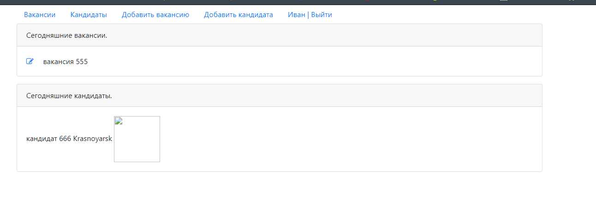
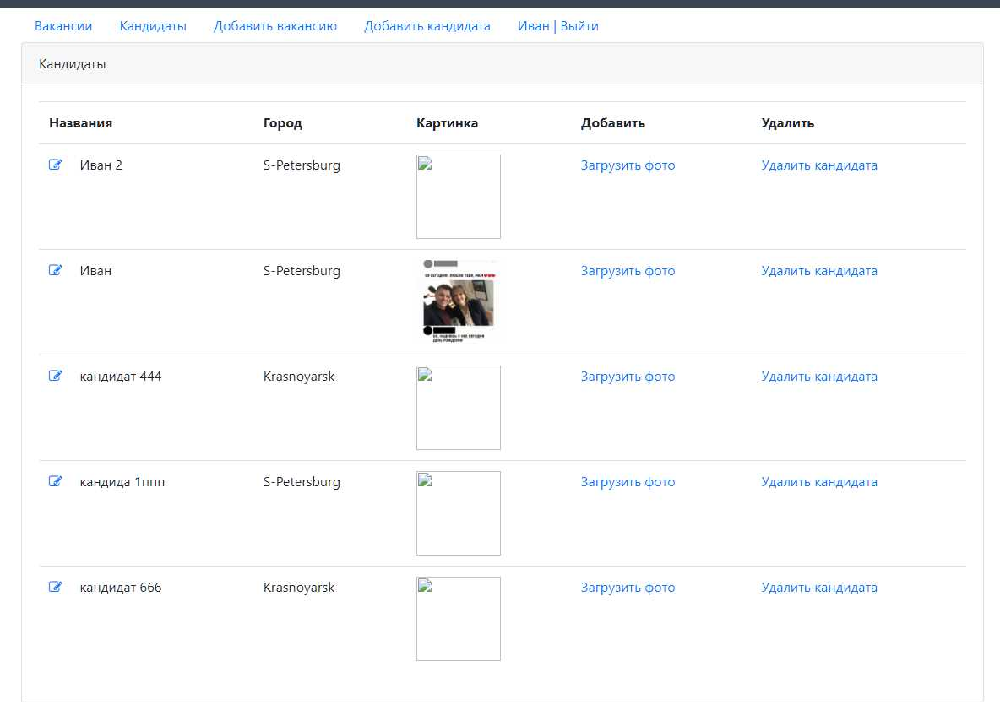

Dreamjob
====================================================
Project: Dream job.
----------------------------------------------------
Account registration is available. After registration, it is possible
to add and edit vacancies and candidates. For vacancie is possible to add "Имя" and 
"Описание". For candidate is possible to add "Имя", "Город" and picture.
On the main page there is a list of today vacancies and candidates.
The project uses Servlets, JSTL, Postgres SQL.

Configuration
----------------------------------------------------
The project should be configured the tomcat.

Usage
----------------------------------------------------
